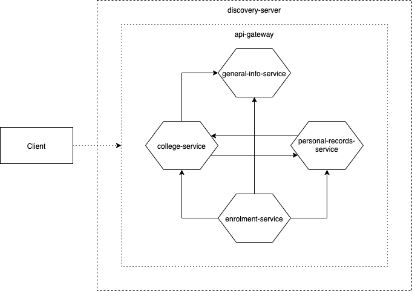

# Generic University
The Generic University is a university system comprising of services built around the Microservices architectural pattern. It's designed to capture the necessary functionalities that occur around the university as an enterprise, such as the enrolment and student registration.

Currently, the system comprises only of some of the functionalities of a univesity. If time permits, other functionalities will be integrated.

# Purpose
The project aims to show examples of usage of various technologies, especially those of the Java and Spring Boot stack. Since the projects are built around the Microservices architecture, introducing and integrating new technologies is even more possible and encouraged for learning purposes. 

# Design


# Technology Stack
1. Java 11
2. Spring Boot
3. Spring Web
4. Spring Data JPA
5. Spring Cloud Gateway
6. Spring Cloud Netfix - Eureka
7. REST
8. Jackson JSON
9. Lombok
10. Postgres
11. Flyway
12. Redis
13. Log4j2
14. Tomcat
15. Docker

# Build, Deploy, Test
## Clone the Repositories
Create a working directory and get inside it. Get [git](https://git-scm.com/) and clone each of the projects.
1. [genuniv-common-util](https://github.com/carzanodev/genuniv-common-util)
2. [genuniv-common-service](https://github.com/carzanodev/genuniv-common-service)
3. [genuniv-general-info-service](https://github.com/carzanodev/genuniv-general-info-service)
4. [genuniv-college-service](https://github.com/carzanodev/genuniv-college-service)
5. [genuniv-personal-records-service](https://github.com/carzanodev/genuniv-personal-records-service)
6. [genuniv-enrolment-service](https://github.com/carzanodev/genuniv-enrolment-service)
7. [genuniv-api-gateway](https://github.com/carzanodev/genuniv-api-gateway)
8. [genuniv-discovery-server](https://github.com/carzanodev/genuniv-discovery-server)

Example:
```shell script
git clone https://github.com/carzanodev/genuniv-common-util.git 
```

## Build and Run
Simply execute `buid-exec.sh`. 
```shell script
sh ./buid-exec.sh
```

This step will take a while as it consists of both the building and running of the services. It does so in the order of the following:
1. Cleaning then installing the genuniv dependencies
2. Cleaning then packaging the genuniv services
3. Execute docker-compose.yml
    * Install all docker images (this takes longer in the first run)
    * Prepare and run the databases in their containers
    * Prepare and run the services in their containers

## Pre-test Processes
After the services have run, you will have to wait for a while for everything to be in place. If you test the services too early, you might get an error indicating that the services aren't ready or that the necessary data of a service that is taken from another service isn't available. 

The following are what's taking place:
1. The discovery-server is launching and preparing the service registry. Since the discovery-server is exposed to the `localhost`, it can easily be checked whether it's up or not.
2. The services are registering themselves to the service registry.
3. The api-gateway is registering itself to the service registry. If the api-gateway is up, this means that we already have a means of testing the services from the `localhost`. This is because the api-gateway is also exposed to the `localhost`.
4. The already-up services are querying from the other services for their needed data.

## Testing the Services
The services are RESTful by design. Testing can be achieved by using the appropriate HTTP method and providing the necessary data asked by that API. Most APIs of the services have a common design standard for doing requests, however some do have their own (it's specified in the documentation of that service). Testing can be done by using `curl`, but using [Postman](https://www.getpostman.com/) is highly encouraged.

All services are not exposed to the localhost. We send requests through the api-gateway, which is exposed through port `18000` in `localhost`. The api-gateway takes care of routing the requests to the appropriate services registered in the discovery-server.

### Retrieve data
#### Retrieve all
Send a `GET` request to `http://localhost:18000/{api_path}`.

Example:

Execute ↓
```shell script
curl -X GET http://localhost:18000/api/v1/college 
```

Response ↓
```json
{
    "response": {
        "colleges": [
            {
                "id": 1,
                "name": "College of Arts and Science"
            },
            {
                "id": 2,
                "name": "College of Commerce"
            },
            {
                "id": 3,
                "name": "College of Engineering"
            },
            {
                "id": 4,
                "name": "College of Education"
            },
            {
                "id": 5,
                "name": "College of Nursing"
            },
            {
                "id": 6,
                "name": "College of Information and Technology"
            }
        ]
    },
    "meta": {
        "message": "Query returned 6 results!",
        "timestamp": "2020-01-13T14:13:42.365+0000"
    }
}
```

#### Retrieve by ID
Send a `GET` request to `http://localhost:18000/{api_path}/{id}`.

Example:

Execute ↓
```shell script
curl -X GET http://localhost:18000/api/v1/college/1 
```

Response ↓
```json
{
    "response": {
        "id": 1,
        "name": "College of Arts and Science"
    },
    "meta": {
        "message": "Successfully retrieved data with id = 1!",
        "timestamp": "2020-01-13T14:16:29.047+0000"
    }
}
```

### Add data
Send a `POST` request to `http://localhost:18000/{api_path}`.

Example:

Given `data.json` ↓
```json
{
	"name": "sample college 123"
}
```

Execute ↓
```shell script
curl -H 'Content-Type: application/json' -d @data.json -X POST http://localhost:18000/api/v1/college 
```

Response ↓
```json
{
    "response": {
        "id": 7,
        "name": "sample college 123"
    },
    "meta": {
        "message": "Successfully inserted data with id = 7!",
        "timestamp": "2020-01-13T14:26:03.167+0000"
    }
}
```

### Update data
Send a `PUT` request to `http://localhost:18000/{api_path}/{id}`.

Example:

Given `data.json` ↓
```json
{
	"name": "update sample college 456"
}
```

Execute ↓
```shell script
curl -H 'Content-Type: application/json' -d @data.json -X PUT http://localhost:18000/api/v1/college/7
```

Response ↓
```json
{
    "response": {
        "id": 7,
        "name": "update sample college 456"
    },
    "meta": {
        "message": "Successfully updated data with id = 7!",
        "timestamp": "2020-01-13T14:36:37.607+0000"
    }
}
```

### Delete data
Send a `DELETE` request to `http://localhost:18000/{api_path}/{id}`.

Example:

Execute ↓
```shell script
curl -X DELETE http://localhost:18000/api/v1/college/7
```

Response ↓
```json
{
    "response": {
        "id": 7,
        "name": "update sample college 456"
    },
    "meta": {
        "message": "Successfully deleted data with id = 7!",
        "timestamp": "2020-01-13T14:45:23.778+0000"
    }
}
```

## Start, Stop, Restart the Containers
To stop/start/restart a container, execute ↓
```shell script
docker {stop|start|restart} container-name
```

To stop/start/restart all containers of genuniv, execute ↓
```shell script
docker-compose -p genuniv {stop|start|restart}
```

## Bash to Containers
To bash inside the containers (especially services), execute ↓
```shell script
docker exec -it container-name /bin/bash
```

### Postgres
To go to Postgres CLI to check the databases, execute ↓
```shell script
docker exec -it postgres-db  psql -h localhost -U postgres
```

### Redis
To go to Redis CLI to check the KVS, execute ↓
```shell script
docker exec -it redis-kvs redis-cli
```
